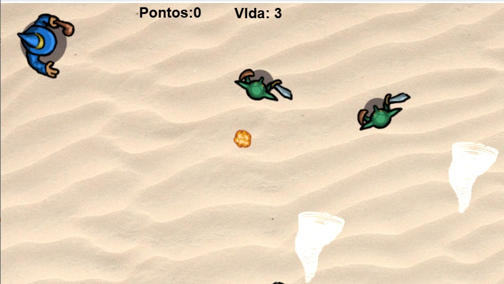
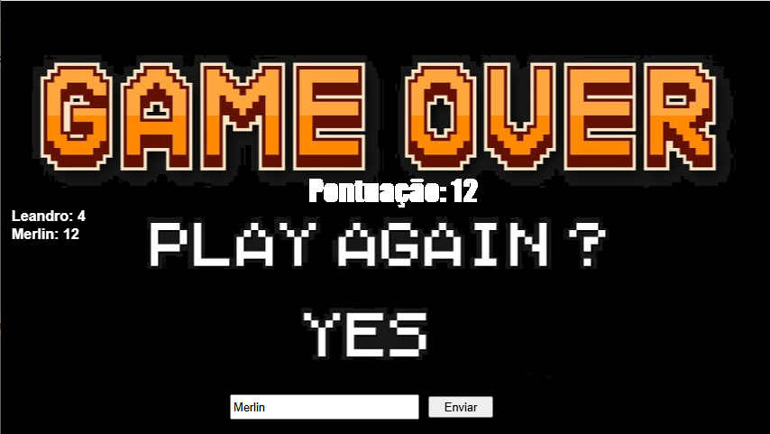
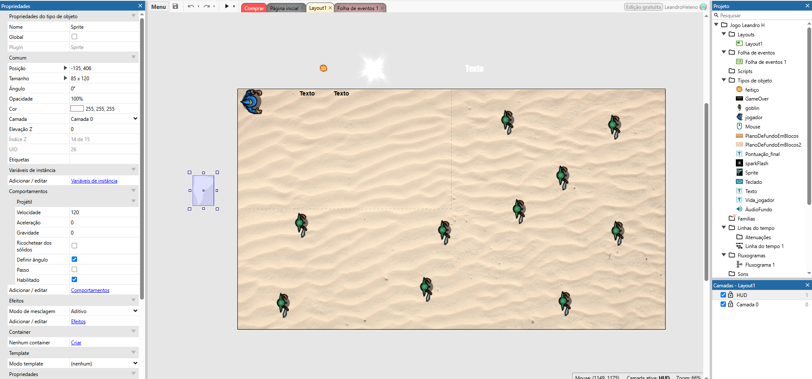
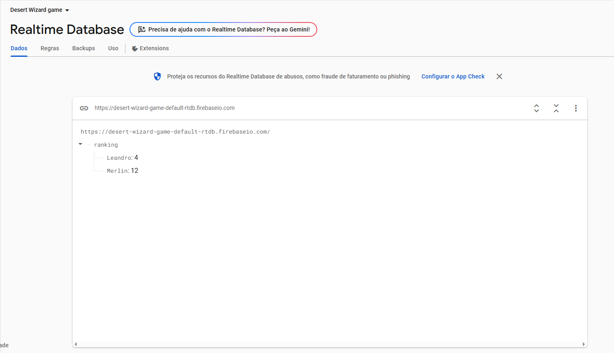
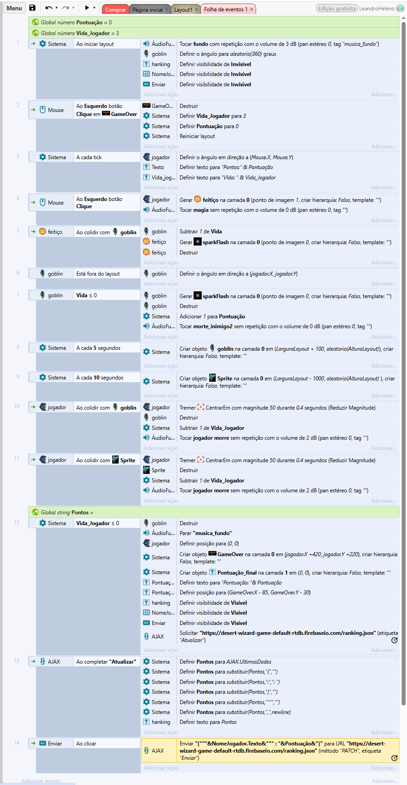

🔥 Wizard Desert

Wizard Desert é um jogo de ação em 2D onde você controla um mago que deve:
•	🔥 Atirar magias para derrotar goblins
•	🌪️ Desviar de tempestades mortais (não podem ser destruídas)
•	🏆 Competir no ranking global via Firebase
Tecnologias usadas:
•	Construct 3 (motor do jogo)
•	Firebase (banco de dados em tempo real)

Wizard Desert is a 2D action game where you:
•	🔥 Cast spells to defeat goblins
•	🌪️ Dodge deadly storms (indestructible)
•	🏆 Compete on global leaderboards via Firebase
Tech stack:
•	Construct 3 (game engine)
•	Firebase (realtime database)

🌐 JOGUE AGORA / PLAY NOW
▶ URL OFICIAL: Play Wizard Desert  (https://www.construct.net/en/free-online-games/wizard-desert-75921/play)

🖼️ LAYOUT DO JOGO / GAME LAYOUT 

1.	Barra superior: Mostra pontuação (Pontos) e vidas restantes (Vida)
2.	Área principal:
o	Mago (jogador, azul)
o	Goblins (inimigos, verdes)
o	Tempestades (perigos ambientais, roxo)
3.	Controles:
o	Setas do teclado para movimento
o	Mouse para mirar e atirar

1.	Top bar: Displays score (Pontos) and lives (Vida)
2.	Main area:
o	Wizard (player, blue)
o	Goblins (enemies, green)
o	Storms (environmental hazards, purple)
3.	Controls:
o	Keyboard arrows for movement
o	Mouse for aiming/shooting

🔌 BANCO DE DADOS / DATABASE
Estrutura do Firebase:
json
Copy
Download

{
  "ranking": {
    "Leandro": 4,
    "Merlin": 12
  }
}
Funcionalidades:
•	Armazena as maiores pontuações
•	Atualização em tempo real
•	Protegido por App Check (contra fraudes)

Firebase Structure:
json
Copy
Download
{
  "ranking": {
    "Leandro": 4,
    "Merlin": 12
  }
}
Features:
•	Stores top player scores
•	Real-time updates
•	Protected by App Check (anti-fraud)

⚙️ REGRAS DO JOGO / GAME RULES

Ação	Efeito
Tocar em goblin/tempestade	Perde 1 vida
Acertar goblin 3x	+1 ponto
Tempestades	Apenas desvie!
Fim de jogo:
•	Quando as vidas chegarem a zero
•	Pontuação enviada para o ranking

Action	Effect
Touch goblin/storm	Lose 1 HP
Hit goblin 3x	+1 point
Storms	Dodge only!
Game Over:
•	When HP reaches 0
•	Score submitted to leaderboard

⚠️ ATENÇÃO / WARNING
Tempestades não podem ser destruídas! Apenas desvie delas ou perderá 1 vida.
Storms cannot be defeated! Only dodge them or lose 1 HP.

🎮 DESCRIÇÃO / DESCRIPTION

Você é um mago perdido no deserto, lutando contra hordas de goblins e tempestades indestrutíveis. Use suas magias para derrotar os goblins e desvie das tempestades para sobreviver. Cada goblin derrotado vale pontos!

You’re a wizard lost in the desert, fighting hordes of goblins and indestructible storms. Use your spells to defeat goblins and dodge storms to survive. Each goblin killed scores points!

🕹️ COMO JOGAR / HOW TO PLAY
Controles / Controls
Teclado (Keyboard):

Setas (↑↓→←) → Movimentação / Movement.

Mouse:

Cursor → Mira / Aiming.
Clique Esquerdo → Lança magia / Cast spell.

Regras / Rules
Ação / Action	Efeito / Effect
Tocar em goblin ou tempestade	Perde 1 vida / Lose 1 HP
Acertar goblin com magia	+1 ponto / *+1 point*
Tempestades	Apenas desvie! / Only dodge!

🏆 RANKING
Game Over Screen (Tela de Game Over com ranking / Game Over screen with leaderboard)
Digite seu nome para salvar sua pontuação no ranking global.
Type your name to save your score on the global leaderboard.

🔊 EFEITOS SONOROS / SOUND EFFECTS
Som / Sound		Quando ocorre / When it plays
Fundo de ação	Durante o jogo / Gameplay
Lançar magia		Ao clicar para atirar / Spell cast
Acertar goblin		Magia atingindo goblin / Spell hits goblin
Morte do goblin	Goblin eliminado / Goblin defeated
Dano no mago	Mago tocado por goblin/tempestade / Wizard hit

⚡ PERSONAGENS / CHARACTERS
Personagem	Detalhes
Mago (Wizard)	3 HP, magia única / 3 HP, single spell
Goblin	3 HP, movimento aleatório / 3 HP, random movement
Tempestade (Storm)	Indestrutível / Indestructible

🛠️ INFORMAÇÕES TÉCNICAS / TECH DETAILS

•	Motor: Construct 3
•	Banco de dados: Firebase Realtime
•	Desenvolvedor: Leandro Heleno

•	Engine: Construct 3
•	Database: Firebase Realtime
•	Developer: Leandro Heleno

👨💻 CRÉDITOS / CREDITS
Desenvolvedor / Developer: Leandro Heleno (24004)
Engine: Construct 3
 
  

  
